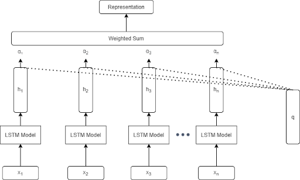

# LSTM 
In this work we have used an attention based LSTM network to classify gesture in the soli dataset.   
The time unrolled operations of our model can be depicted as:        
.    

## Runing Mode
Download all the data dictionaries from links provided and mount them on your google drive, post that just run the cells and you can see the results.